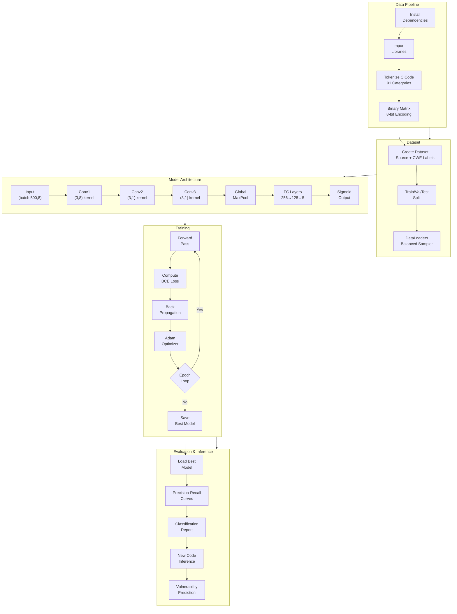

# AVD-DRL
Implementation of Research Paper titled : Automated Vulnerability Detection in Source Code Using Deep Representation Learning by Seas et al.

## Citation
`C. Seas, G. Fitzpatrick, J. A. Hamilton and M. C. Carlisle, "Automated Vulnerability Detection in Source Code Using Deep Representation Learning," 2024 IEEE 14th Annual Computing and Communication Workshop and Conference (CCWC), Las Vegas, NV, USA, 2024, pp. 0484-0490, doi: 10.1109/CCWC60891.2024.10427574. keywords: {Analytical models;Codes;Linux;Computer bugs;Software systems;Security;Kernel;convolutional neural networks;computer security;data mining;machine learning},`

## Background

Abstract from the Paper

Each year, software vulnerabilities are discovered, which pose significant risks of exploitation and system compromise. We present a convolutional neural network model
that can successfully identify bugs in C code. We trained our model using two complementary datasets: a machine-labeled dataset created by Draper Labs using three static analyzers
and the NIST SATE Juliet human-labeled dataset designed for testing static analyzers. In contrast with the work of Russell et al. on these datasets, we focus on C programs, enabling
us to specialize and optimize our detection techniques for this language. After removing duplicates from the dataset, we tokenize the input into 91 token categories. The category values are converted to a binary vector to save memory. Our first convolution layer is chosen so that the entire encoding of the token is presented to the filter. We use two convolution
and pooling layers followed by two fully connected layers to classify programs into either a common weakness enumeration category or as “clean.” We obtain higher recall than prior work by Russell et al. on this dataset when requiring high precision. We also demonstrate on a custom Linux kernel dataset that we are able to find real vulnerabilities in complex code with a low false-positive rate.

## Problem Statement

Introduction

Each year, software vulnerabilities are discovered, which pose significant risks of exploitation and system compromise. The authors present a convolutional neural network (CNN) model to automatically identify bugs/vulnerabilities in C source code.
  

 The key challenges they address:  
1. Detecting software vulnerabilities in source code automatically  
2. The need for large-scale vulnerability detection systems using machine learning  
3. Specialized detection techniques for C programs (unlike prior work that covered both C and C++)  

## Flowchart

